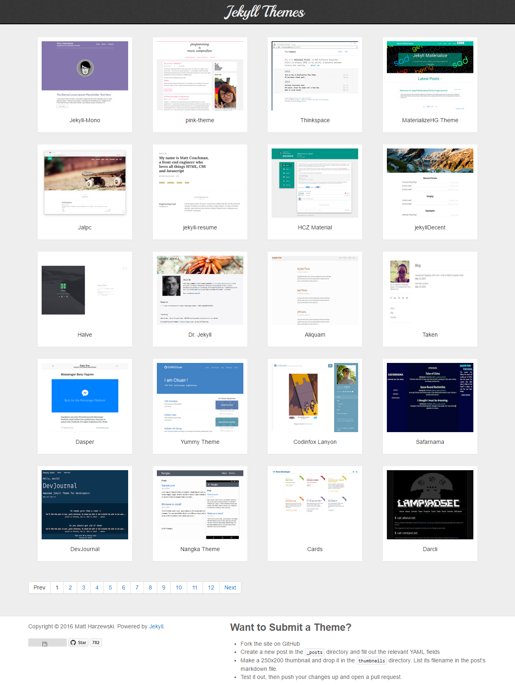
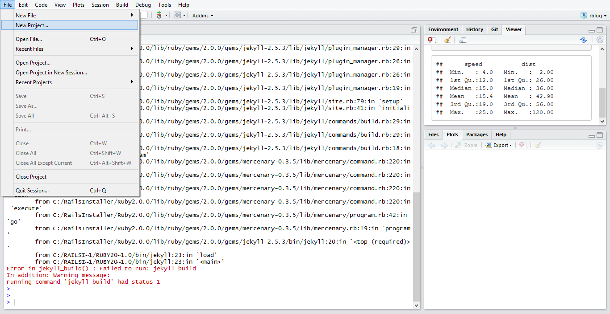
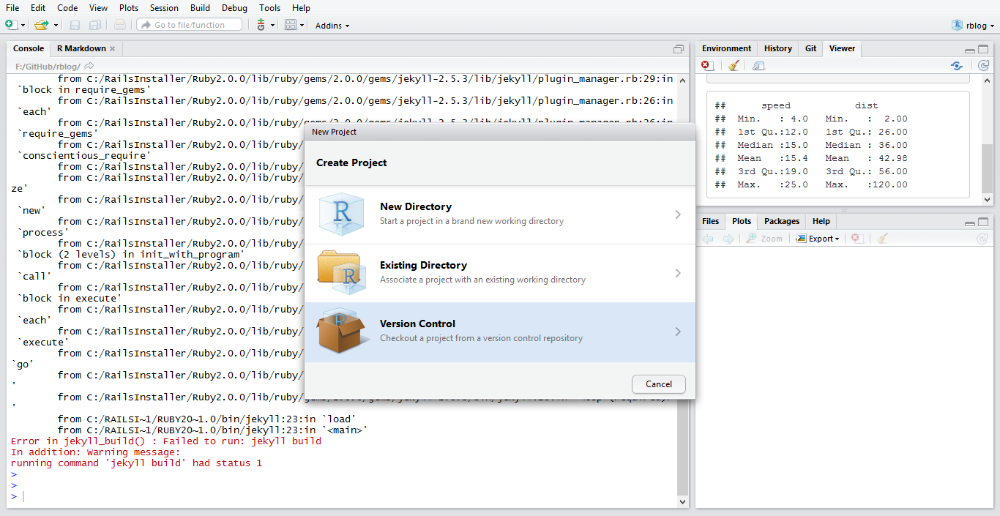
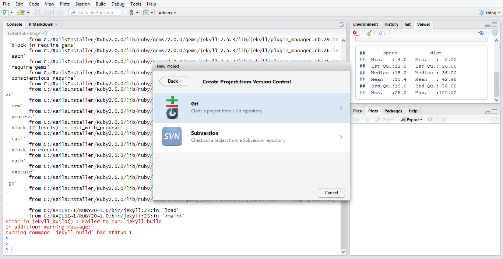
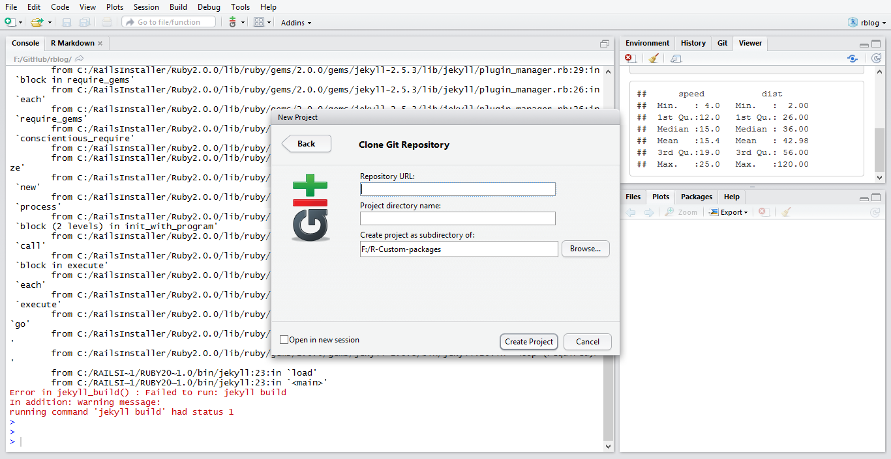

# rblog
Example blog with RStudio, RMarkdown and Jekyll.

## Prerequisits

Install R language, RStudio, Git Bash and Jekyll(Optional if using Github pages)

Install the latest version of the knitr package: <code>install.packages("knitr")</code>

Install other packages as per requirement, Like <code>install.packages("ggplot2");</code> for drawing graphs etc.

Make a theme in Jekyll or use ready-made ones available <a target="_blank" href="http://jekyllthemes.org/">here</a> for your blog

Make a new repository in <a href="https://github.com/>"Github</a> with a default branch of gh-pages and upload that jekyll theme in it

### Screenshot
   
## Cloning jekyll blog in RStudio
<ul>
 <li>File, New project, Version control, Clone git</li>
 <li>Repository URL :<code>https://github.com/your repository</code></li>
 <li>Project directory name : your project directory name</li>
</ul>
### Screenshots
  
  
  
  

## Publishing first post in jekyll blog

<ul>
<li> Make Rmd file in RStudio convert it to md file</li>
<li> Put the md file in _posts folder of jekyll blog</li> 
<li>File name should be like Y-M-D-title.md  e.g <code>2016-08-24-blogtitle.md</code></li>
<li>Add required Front Matter to the newly created md file 
<code>
<pre>
---
layout: post
title: blog title
---
</pre>
</code>
</li>
<li>Push changes to github</li>
</ul>

## Ready

Goto settings of repository and visit the url 
e.g <a href="https://project-spinoza.github.io/rblog/">Visit Blog</a>

