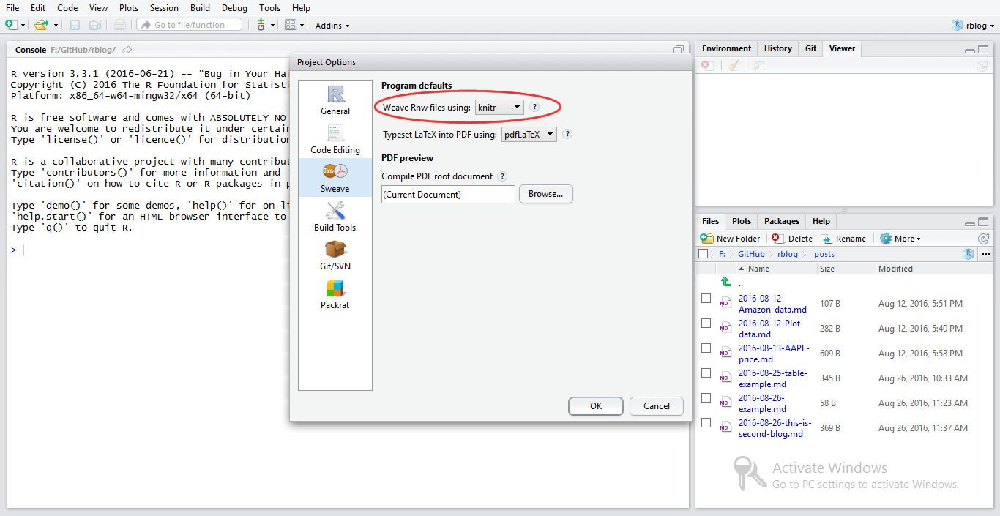
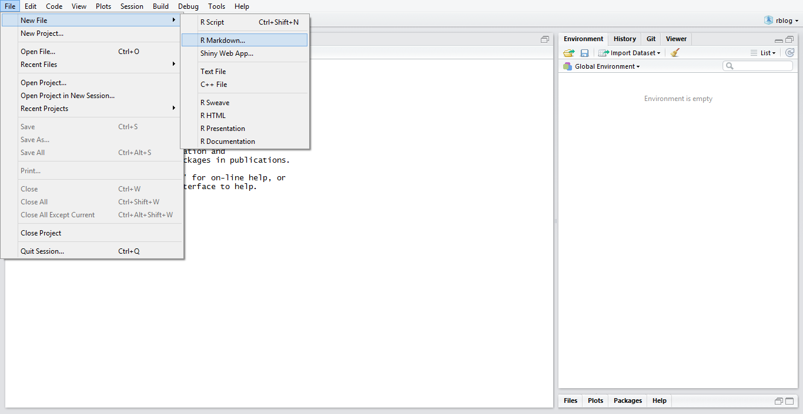
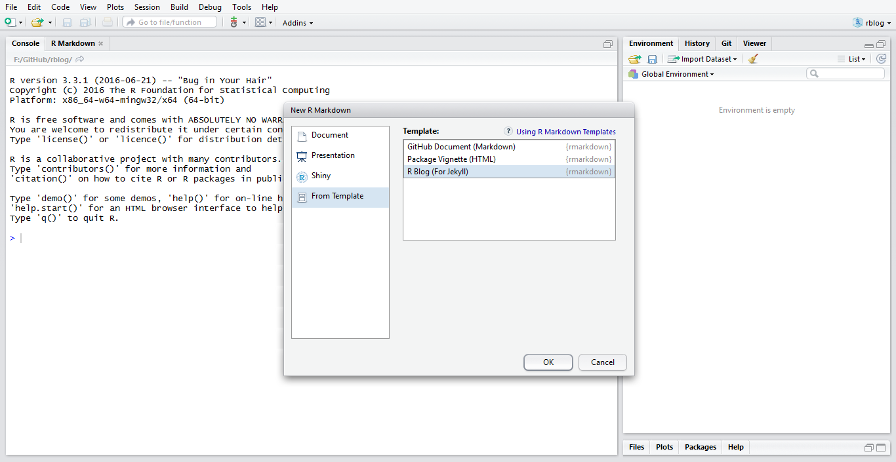
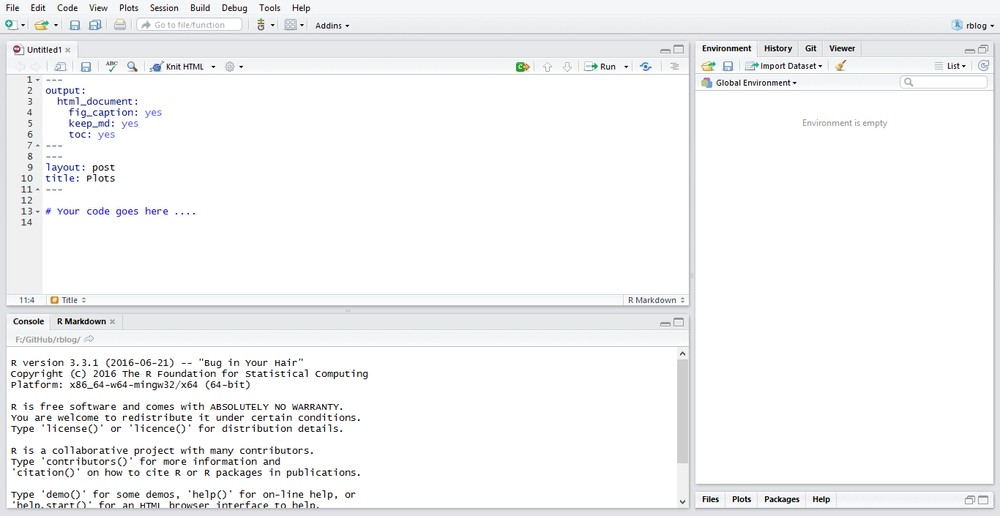
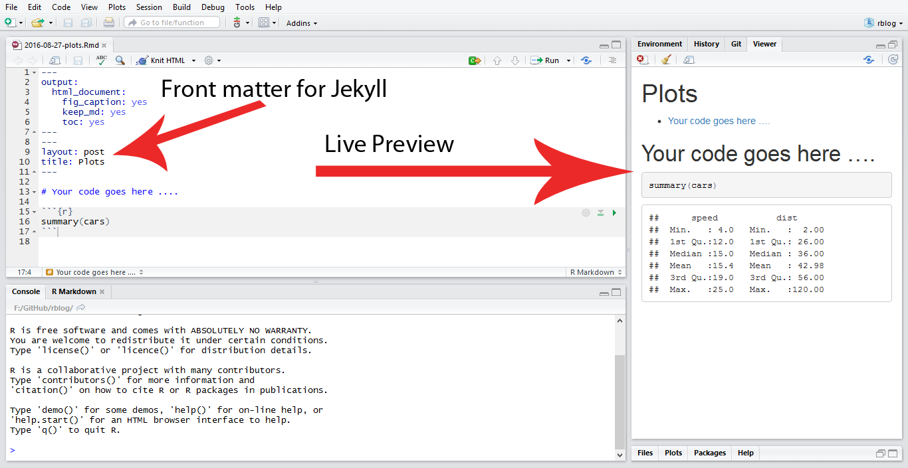

# rblog
Example blog with RStudio, RMarkdown and Jekyll.

## Prerequisits

Install R language, RStudio, Git Bash and Jekyll(Optional if using Github pages)

Install the latest version of the knitr package: <code>install.packages("knitr")</code>

Install other packages as per requirement, Like <code>install.packages("ggplot2");</code> for drawing graphs etc.

Make a theme in Jekyll or use ready-made ones available <a target="_blank" href="http://jekyllthemes.org/">here</a> for your blog

Make a new repository in <a href="https://github.com/">GitHub</a> with a default branch of gh-pages and upload that jekyll theme in it

### Screenshot
   
## Cloning jekyll blog in RStudio
<ul>
 <li>File, New project, Version control, Clone git</li>
 <li>Repository URL :<code>https://github.com/your repository</code></li>
 <li>Project directory name : your project directory name</li>
</ul>
### Screenshots
  
  
  
  

## Publishing first post in your jekyll blog

New post can be added by two methods  
<b>1. User interface</b> 
<b>2. Command line</b> 

### 1. User interface

<ul>
<li>First of all in RStudio goto <code>Tools -> Project Project Options -> Sweave -> Select knitr is default option -> Ok </code></li>
<li>You have to download <code>R Blog (Jekyll)</code> template from <a href="https://github.com/Tajtaj/r_blog/archive/master.zip">here</a></li>
<li>Place <code>r_blog</code> directory in <code>rmarkdown/rmarkdown/templates</code></li>
<li>After that goto <code>File-> New File -> RMarkdown -> From Template -> Select a template R Blog (Jekyll)</code></li>
<li>After that add RMarkdown code in the newly created file save it in <code>_posts</code> directory of your blog with the name  Y-M-D-title  e.g <code>2016-08-24-blogtitle</code> </li>
<li>As Jekyll supports markdown files, so you have to convert rmarkdown to markdown in RStudio by clicking Knit Html link</li>
<li>Now push only md files to github(if using gh-pages)</li>
<li>After that visit your blog and check the post</li>
</ul>
#### Screenshots
  
  
  
  
  

